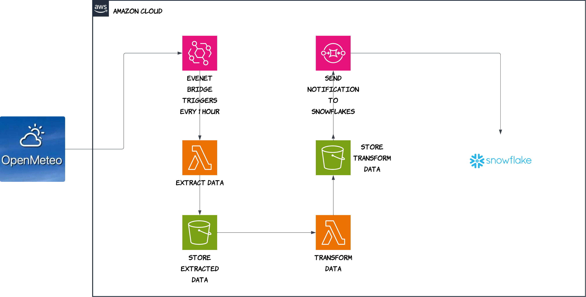

# Weather Data Pipeline

End-to-end **ETL [extract, transform, load — moving data from a source into a usable warehouse]** pipeline that pulls live forecast data for **Chicago**, stores it in **Amazon S3 [cloud file storage]**, reshapes it with **AWS Lambda [serverless functions that run your code on demand]**, and loads it into **Snowflake [a cloud data warehouse for analytics]** for reporting.

---

## Highlights

- **Open-Meteo API** — free weather API; no API key required for the forecast endpoint used here.
- **Two Lambda functions** — separation of **raw JSON** (`raw_data/`) and **cleaned CSV** (`transformed_data/`) in S3.
- **Amazon EventBridge** — optional **schedule [a rule that runs on a timer, e.g. every hour]** to start the extract Lambda automatically.
- **Snowflake** — external stage, **Snowpipe [automatic ingest when new files land in S3]**, scheduled **task** into a curated hourly table, and a **daily summary view** for BI tools. In AWS, **S3 event notifications** (often paired with **Amazon SNS [a publish/subscribe messaging service]** or **SQS [a message queue]**) can signal Snowpipe that new objects are ready.

---

## Architecture

Flow summary (matches the diagram):

1. **Amazon EventBridge** runs on a schedule (for example **every hour**).
2. **Lambda (extract)** calls **Open-Meteo**, then writes **raw JSON** to **S3** (`raw_data/`).
3. **Lambda (transform)** reads from `raw_data/`, writes **CSV** to **S3** (`transformed_data/`).
4. **Event-driven path to Snowflake**: when new files land (diagram: *“send notification to Snowflake”*), **Snowpipe** picks them up—on AWS this is usually wired with **S3 event notifications** and Snowflake’s **auto-ingest** queue/topic setup, not a separate “push” from your Python code.
5. Inside Snowflake: **landing table** → **scheduled task** → **hourly** table → **`v_daily_summary`** view.

### Architecture diagram (image)

---

## Tech stack

| Layer | Technology |
|--------|------------|
| Source | [Open-Meteo](https://open-meteo.com/) Forecast API |
| Scheduling | Amazon EventBridge (example: hourly trigger) |
| Compute | AWS Lambda (Python) |
| Object storage | Amazon S3 |
| Ingest signaling | S3 events → Snowpipe auto-ingest (SQS; SNS optional in broader designs) |
| Warehouse & orchestration | Snowflake (stage, pipe, task, views) |
| Libraries | `requests`, `boto3`, `pandas` |

---

## Repository layout

| Path | Purpose |
|------|---------|
| `weather_extract.py` | Lambda **extract**: HTTP GET → JSON → upload to `s3://…/raw_data/` |
| `wearther_data_transform.py` | Lambda **transform**: read JSON from `raw_data/`, write CSV to `transformed_data/` |
| `snowflake.sql` | Database objects: stage, tables, `COPY`, pipe, task, `v_daily_summary` |
| `architecture_diagram.png` | Architecture diagram for README / portfolio |

> **Note:** Replace the example bucket name `weather-data-pipeline-v1` in code/SQL with your own bucket when you fork this project.

---

## Data model (Snowflake)

- **`weather_raw_data`** — landed rows plus a `VARIANT` column holding structured JSON for traceability.
- **`weather_hourly`** — curated table populated incrementally by the task (only rows newer than the latest `recorded_at`).
- **`v_daily_summary`** — daily aggregates (avg/min/max temperature, precipitation, wind, dominant weather code).

CSV columns from the transform step align with the `COPY INTO` column list in `snowflake.sql` (time, temperature, precipitation, wind, weather code, lat/long, timezone, elevation).

---

## Prerequisites

Before you deploy or run pieces of this pipeline:

1. **AWS account** — S3 bucket, two Lambda functions, and (recommended) **IAM roles** for Lambda instead of long-lived access keys.
2. **Snowflake account** — warehouse (e.g. `COMPUTE_WH`), ability to create database, schema, stage, pipe, and tasks.
3. **S3 notifications** — configure the bucket or path so **Snowpipe auto-ingest** can pick up new files (per Snowflake docs for your cloud region).
4. **Python 3.12** (or match your Lambda runtime) if you test locally.

**Lambda deployment packages** need compatible versions of:

- `requests`
- `boto3` / `botocore`
- `pandas` (and its dependencies for the runtime)

---

## Configuration

### AWS Lambda environment variables

The code reads credentials from environment variables (suitable for learning; production should use an **IAM execution role** and remove embedded keys).

| Variable | Used in | Notes |
|----------|---------|--------|
| `access_keys` | `weather_extract.py` | AWS access key id |
| `access_key` | `wearther_data_transform.py` | Same idea — **use one consistent name** across both functions to avoid mistakes |
| `secret_key` | Both | AWS secret access key |

### Snowflake stage credentials

In `snowflake.sql`, replace the placeholder `AWS_KEY_ID` / `AWS_SECRET_KEY` in the `CREDENTIALS` clause with your integration approach (often a **storage integration** or **external access** per Snowflake best practices — avoid committing real secrets to Git).

### Chicago location (API)

Default coordinates in `weather_extract.py`: **latitude 41.8781, longitude -87.6298** (`America/Chicago`, Fahrenheit). Edit the Open-Meteo URL to change location or units.

---

## How to run (high level)

1. **Create** the S3 bucket and prefixes `raw_data/` and `transformed_data/`.
2. **Deploy** `weather_extract.py` and `wearther_data_transform.py` as separate Lambdas with appropriate timeout, memory, and layers for `requests` / `pandas`.
3. **Trigger** the extract Lambda on a schedule (EventBridge) or manually; chain or schedule the transform after new objects appear in `raw_data/`.
4. **Execute** `snowflake.sql` in a Snowflake worksheet in order (adjust `USE DATABASE` / `USE SCHEMA` and warehouse name).
5. **Wire** S3 event notification → Snowpipe (auto-ingest), then **resume** the task after creation (`ALTER TASK … RESUME`).

---

## Security

- Do **not** commit AWS keys, Snowflake passwords, or private connection strings.
- Prefer **IAM roles for Lambda**, **Snowflake secrets/storage integrations**, and a `.gitignore` that excludes `.env`, keys, and large local artifacts (e.g. embedded `python/` site-packages if present only for local testing).

---

